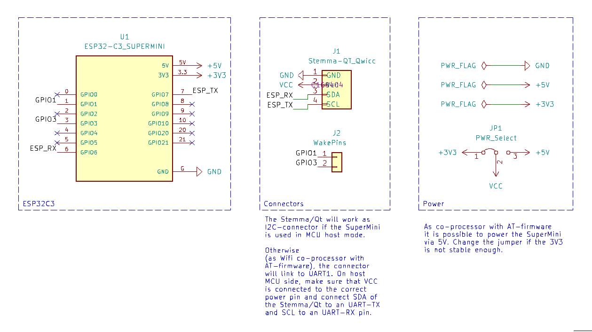
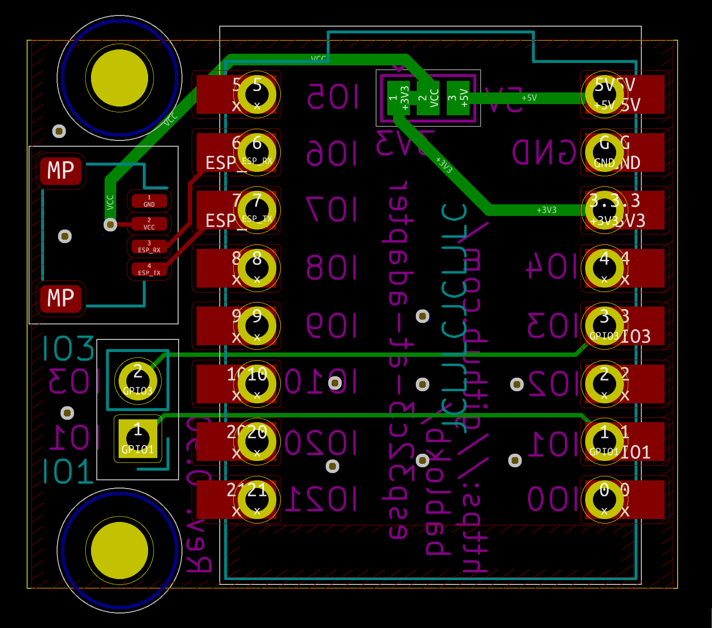
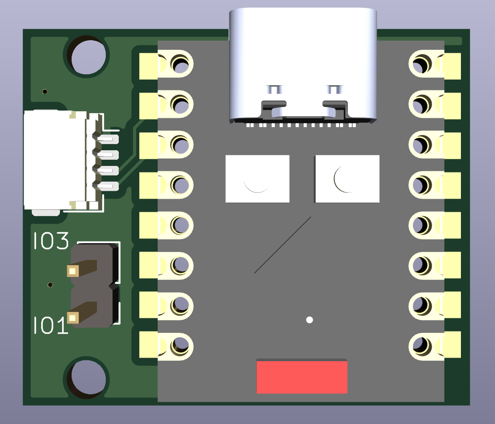
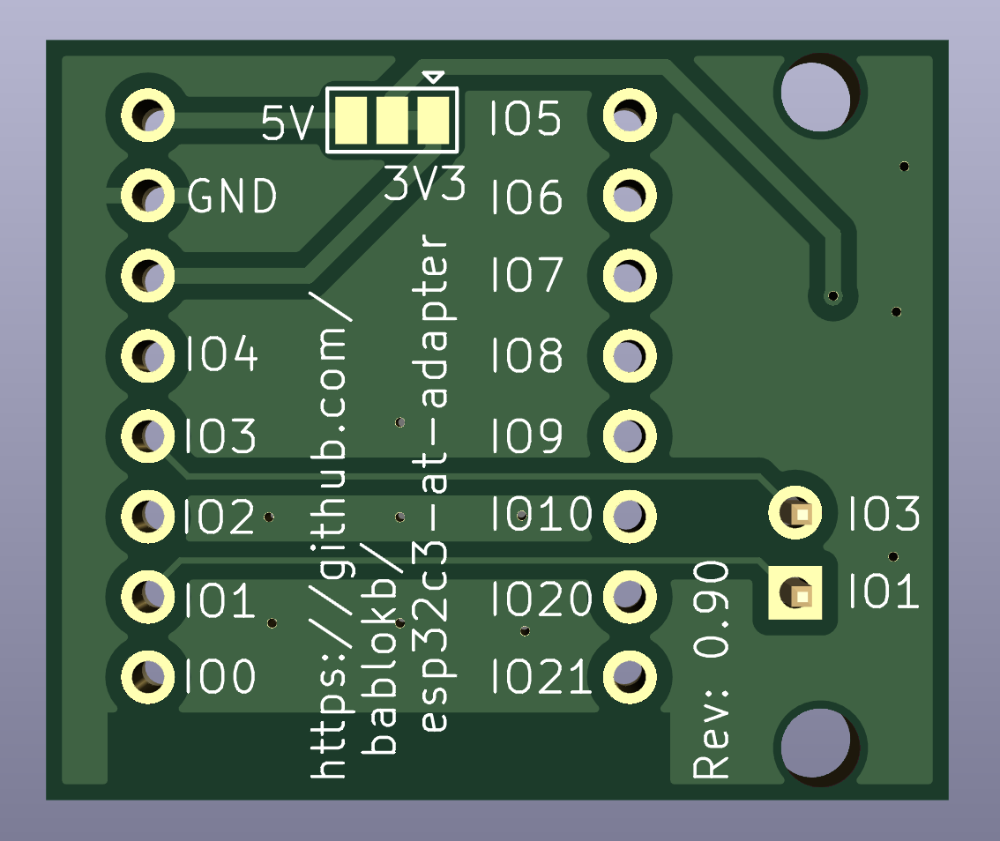

Adapter-PCB for ESP32C3 SuperMini Running ESP-AT Firmware
=========================================================

This small breakout for the ESP32C3 SuperMini adds an Stemma/Qt
connector for the pins of UART1. This allows the ESP32C3 to be used as
a wifi co-processor. The other side of the Stemma/Qt must be connected
to power, ground and an UART of the host MCU. This could also be a
Stemma/Qt connector, if the respective pins of the host can also be
repurposed from I2C to UART.

Note: the VCC of the Stemma/Qt is connected to 3V3. The SuperMini is
usually happy with this direct 3V3 power-supply (this skips the
internal regulator).  As an alternative, change the jumper on the back
to 5V and feed 3.3-6V from the host MCU.  According to the datasheet
of the regulator, it does not deliver 3.3V with an input lower than
about 3.5V, but my tests show that the SuperMini is robust in this
respect.

The SuperMini can also be used in standalone mode. In this case, the Stemma/Qt
serves as an ordinary I2C connector.

See <https://github.com/bablokb/circuitpython-esp32at> for a software solution.

Ready to use production files for JLCPCB are in the directory `production_files/`.

Schematic
---------

Layout
------

3D-Views
--------

License
-------

[![CC BY-SA 4.0][cc-by-sa-shield]][cc-by-sa]

This work is licensed under a
[Creative Commons Attribution-ShareAlike 4.0 International
License][cc-by-sa].

[![CC BY-SA 4.0][cc-by-sa-image]][cc-by-sa]

[cc-by-sa]: http://creativecommons.org/licenses/by-sa/4.0/
[cc-by-sa-image]: https://licensebuttons.net/l/by-sa/4.0/88x31.png
[cc-by-sa-shield]:
https://img.shields.io/badge/License-CC%20BY--SA%204.0-lightgrey.svg
